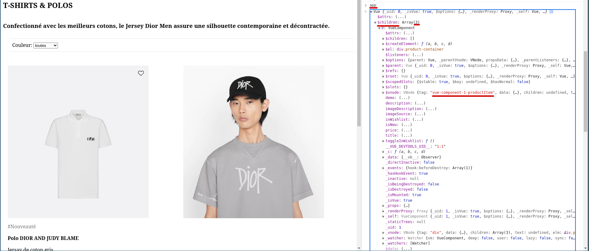
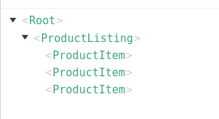

# Découper en composants réutilisable

Comme expliquer précédemment dans les avantages des frameworks, la capacité à découper son affichage de page web en éléments réutilisable permets de construire des applications bien plus facilement et sans passer son temps à dupliquer du code.

Pour en revenir à notre exercice d'une page de listing produit, on commence à avoir une page html chargé qui contient en effet les informations liée à la page, à la liste et à chaque produit. Notre objectif va alors être de découper cette page en composants distinct.

## Déclarer un composant avec Vuejs est simple

```js
Vue.component('product', {
  props: ['title', 'subTitle'],
  template: '<p class="product-title">{{ title }}: {{ subTitle }}</p>',
});

var app = new Vue({
  ...
});
```

1. On défini donc les composants avant d'initialiser l'instance Vuejs de l'application.
2. On défini dans `props` les variables que l'on pourra passer au composant
3. Dans `template`, on défini sous forme de string le template html du composant qui peux donc directement utiliser les `props`. 🚸 Attention le template doit posséder un seul élément parent:

```js
❌ template: `<p>{{ title}}</p><span>{{ subTitle }}</span>`,
✅ template: `<div>
                <p>{{ title}}</p>
                <span>{{ subTitle }}</span>
              </div>`,
```

On remarque l'astuce d'utiliser une ``` backtick (ou accent grave) pour écrire une string sur plusieurs lignes (le html n'étant de plus pas sensible aux espaces, on peut l'indenter correctement pour que le code reste lisible comme sur l'exemple ci-dessus)

1. Si nécessaire on peut la encore définir une fonction `data` pour définir un état interne au composant (ex, pour le produit s'il appartient à la liste de souhait)

## Utiliser un composant avec Vuejs est (encore plus) simple

Pour utiliser un composant déclarer comme `product` ci-dessus, on écrit directement son nom en temps que balise dans du html et on peux passer chaque `prop` comme un attribut customisé:

```html
<div class="page-container" id="app">
  <div v-for="product in filteredProducts">
    <product :title="product.title" :sub-title="product.subTitle"></product>
  </div>
</div>
```

🚸 Attention, on remarquera que l'on passe de la camelCase (convention pour les variables en javascript) à l'équivalent kebab-case (délimités par des tirets) pour les props et pour les noms de composants.

## Exercice

pour l'exercice 5 je propose de créer un composant dédié pour produit. quelques indications:

- Débutes par la creation d'un composant dans le même fichier HTML dans un balise script précédant la balise instanciant l'application Vuejs.
- Définis chaque prop dont tu as besoin dans ton composant (à priori l'ensemble des propriétés des produits)
- Utilises dans le HTML de ta page ton nouveau composant Vuejs 🎉
- Définis le css liée à produit dans une balise à part du reste du css
- Extraits dans un fichier JS et CSS à part la definition du composant (dans un dossier regroupant CSS et JS) et importe dans les dans le fichier HTML principale de ta page ces definitions. 🚸 Attention, ces import doivent ce faire après la definition de vuejs (balise script qui importe Vuejs) mais avant l'instanciation de l'application.

Une fois terminé le code de productItem devrait être séparé dans un nouveau dossier et dans l'application l'instance racine devrait avoir 3 children productItem:



## Plus d'exercices

Pour pratiquer, tu peux créer un composant qui liste des produits à partir des filtres qu'on lui passe.



Tu peux alors passer à la [dernière leçon des basiques](../CompletingBasics/README.md) où l'on va faire le point sur ce que l'on a vue ✨ et utiliser une API pour récupérer les produits directement à la place de définir la liste des produits à la main.
