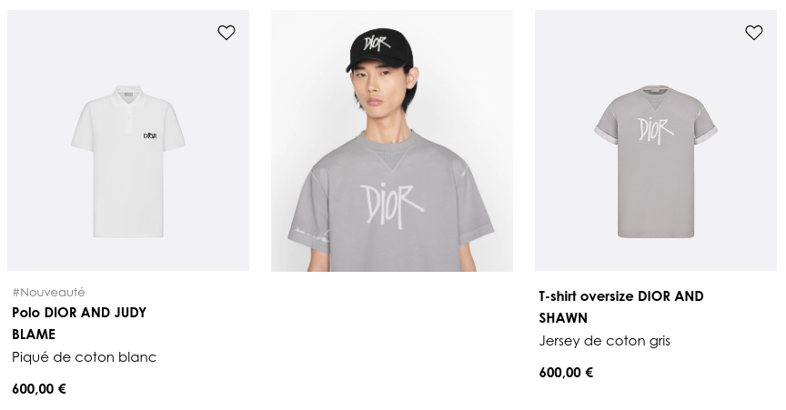
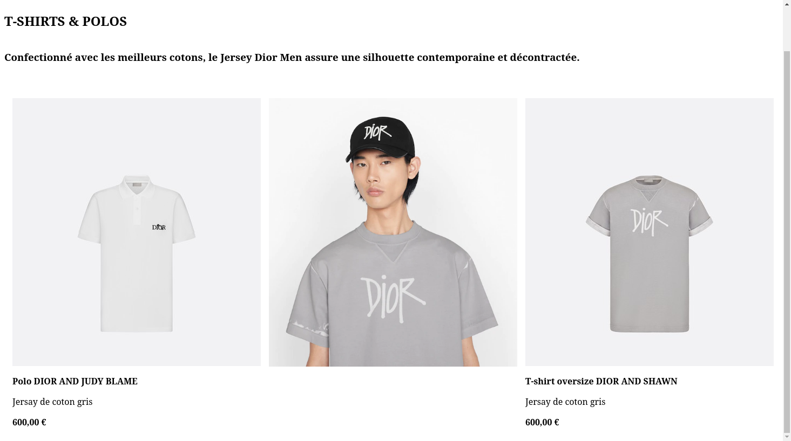

# Utiliser les conditions et les boucles en Vue.js

L'objectif va être maintenant d'obtenir la ligne complete de produit suivante:



Pour ce faire, dans le dossier de lexercice 3, j'ai ajouté leurs info dans l aliste '_products_'.

Tout d'abord, on remarque que les deux produit aux extremités (polo et T-shirt) sont très similaire, puisque la seule différence est le label nouveauté present en plus sur le polo. Nous allons donc vouloir utiliser une boucle pour decrire ce que l'on veut dans le HTML plutôt que recopier de nouveau le HTML pour afficher un produit.

## Utilisons une boucle

En Vue.js une boucle s'utilise simplement avec l'instruction `v-for="element in enumerable"`, ainsi, on va pourvoir utiliser 'element' directement. Si `enumerable=[1,2,3], on peut utiliser la boucle suivante:

```html
<ul>
  <li v-for="index in enumerable" :key="index">
    Ce point de la liste est le numero: {{ index }}
  </li>
</ul>
```

Utilisons cette technique pour afficher les 3 produits:


## Utiliser des conditions

Grâce à la boucle 'v-for', nous avons déjà un affichage en liste, complétons notre rendu souhaité grâce aux conditions pour afficher le label 'nouveauté' et supprimer les balise présentes sous la photo de mise en scène au milieu.

Pour rendre une balise selon une condition en Vue.js, il suffit d'utiliser l'instruction `v-if` comme ceci:

```html
<div v-if="variableBooléenne">
  Je ne suis rendu que la variable booléenne est vrai !
</div>
```

Ajoute donc le label nouveauté si le produit est nouveau ✨ et ne rends pas le titre, description et prix pour l'image de mise en situation.
