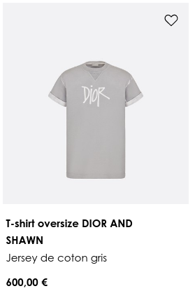
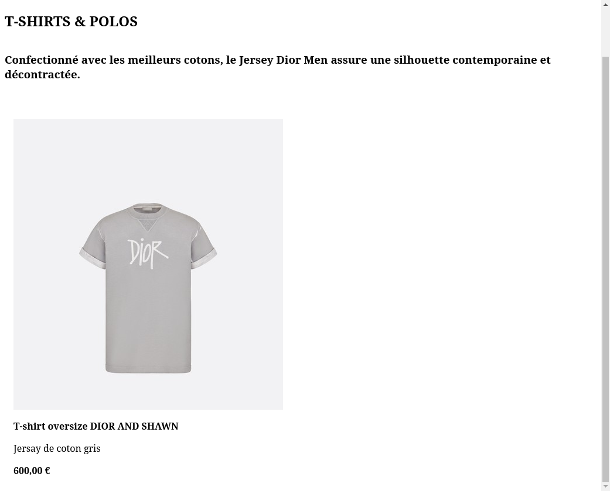

# Rendre notre premier produit

Nous allons maintenant rendre notre premier produit de notre liste de produit présenté:

Pour ce faire, pour l'exercice 2, tu as une page avec vuejs déjà prête avec toutes les info du produit disponible, qu'il va falloir injecter.

## Les info produits

Débutons par le plus simple que nous avons déjà vu dans la partie précédente, pour rendre dans du HTML une valeur Vue.js disponible dans `data`, il suffit d'utiliser les double accolade. Ainsi tu peux ajouter le titre produit en gras, la description et le prix, du produit disponible : `{{ products[0].<propriété de l'objet> }}`.

## Les attributs Vue.js

Vue.js permet aussi de rendre dynamiquement les valeurs des attributs des balise, nous allons le faire avec le balise image. La syntaxe pour liée un attribut est simplement `"` ('_bind_' signifiant '_lier_' en anglais). Plus simplement, on peut écrire la syntaxe suivante: `"`, plus facile à retenir.

💡 N'oublie pas d'ajouter la description alternative de l'image: elle est indispensable pour l'accessibilité du web (ex: malvoyant): c'est l'attribut `alt`.

Lorsque tu as fini, tu devrais avoir un produit unique, tu peux passer à la [section suivante sur les condition et boucle](../ConditionalsAndLoops/README.md).

