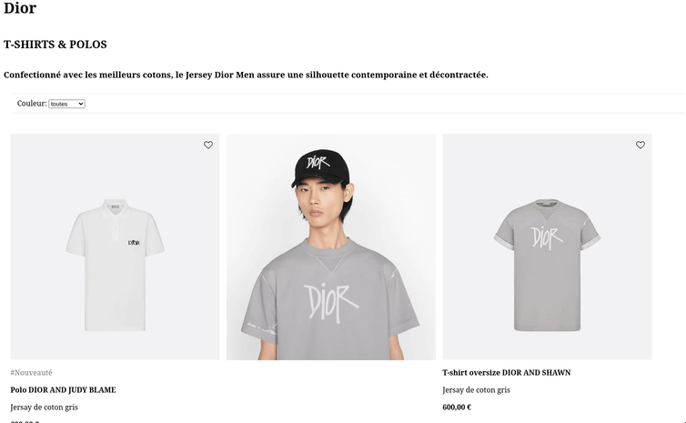

# Gestion des entrées utilisateur

Nous allons maintenant nous intéresser à la gestion des entré utilisateur, pour ce faire en Vuejs, il suffit d'écouter les événements émient par les instances, pour un exemple concret on utilise la directive `v-on:click="maMethodeOnClick"` pour réagir au click sur un bouton.

## Réagir à des clics utilisateur

Testons tout de suite ce fonctionnement avec le début de l'exercice 4: l'objectif est réagir au clique sur l'icône cœur d'un produit pour le transformer en icône remplie (et simuler l'addition à une liste de souhait).

Pour ce faire, il suffit de changer l'image utiliser pour le cœur `heart_full.svg` ou `heart_empty.svg` lors du click. J'ai aussi ajouté la propriété à la liste des produits et créé une méthode qui bascule cette valeur booléenne lorsqu'elle est appelée avec un produit en argument.

Bon à savoir :

- On peut utiliser des ternaires dans un binding vuejs: `
`

## Réagir à une entrée texte utilisateur

Vuejs permet aussi de réagir à des entrées utilisateur sur des champs: texte,sélecteur, checkbox, etc. Nous allons essayer cette directive en implémentant un filtre pour notre page pour par exemple afficher uniquement une couleur donnée.

Pour lier l'état d'un champ à une valeur reactive stocké dans l'object data de vuejs, il suffit d'utiliser la directive `v-model="nomDeLaVariable"`, ainsi dès que la valeur est changé par l'utilisateur, la valeur est mise à jour dans l'object data de Vuejs.

Pour ce faire, j'ai ajouté un calcul dynamique des produits à afficher grâce à `computed`. Les méthodes définies dans 'computed' doivent toujours retourné une valeur qui est recalculé lorsque les propriétés qu'elles utilisent changent. Cela permet dans notre exemple de filter les produits à afficher en fonction de la couleur.

Une fois les options et la directive v-model ajoutées sur le select, tu dois retrouver l'exemple ci-dessus.

Le fichier index commence à être bien chargé, [il est temps d'explorer le découpage en composant](../ComposingWithComponents/README.md), un des avantages principale des framework.
