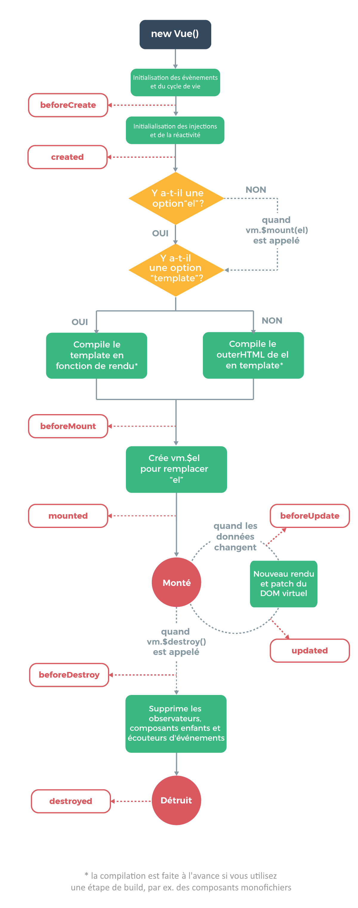

# Hooks de cycle de vie d’une instance

Chaque instance de vue traverse une série d’étapes d’initialisation au moment de sa création - par exemple, elle doit mettre en place l’observation des données, compiler le template, monter l’instance sur le DOM et mettre à jour le DOM quand les données changent. En cours de route, elle va aussi invoquer des hooks de cycle de vie, qui nous donnent l’opportunité d’exécuter une logique personnalisée à chaque niveau.

Par exemple, le hook created est appelé une fois l’instance créée :

```js
new Vue({
  data: {
    a: 1
  },
  created: function () {
    // `this` est une référence à l'instance de vm
    console.log('a is: ' + this.a)
  }
})
// => "a is: 1"
```

Il y a aussi d’autres hooks qui seront appelés à différentes étapes du cycle de vie d’une instance, par exemple mounted, updated et destroyed. Tous ces hooks de cycle de vie sont appelés avec leur this pointant sur l’instance de la vue qui les invoque.

**⚠ Attention** :
N’utilisez pas les fonctions fléchées sur une propriété ou fonction de rappel d’une instance (par exemple created: () => console.log(this.a) ou vm.$watch('a', newVal => this.myMethod())). Comme les fonctions fléchées sont liées au contexte parent, this ne sera pas l’instance de Vue comme vous pourriez vous y attendre, et vous rencontrerez alors des erreurs comme Uncaught TypeError: Cannot read property of undefined ou Uncaught TypeError: this.myMethod is not a function.

## Diagramme du cycle de vie


