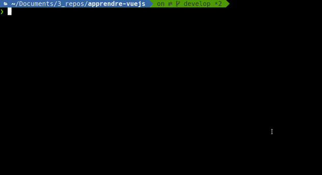

# Débuter le projet de site e-commerce

## Objectif

À la fin de ce tutoriel, tu auras réalisé un site e-commerce basique comportant:

- des page produits
- des page collection de produit
- une page d'accueil/landing page
- une page de payment

## Comment fonctionnent les exercices

Tu vas réaliser ce site e-commerce petit à petit à force d'exercice pratique. Je vais ici t'expliquer comment utiliser les exercices du repository et tu installeras les premiers outils requis:

- Si ce n'est pas encore fait, [installes npm, nodejs et les dépendances global de ce projet](../installingNodeJsAndNPM/README.md)
- Créer ta propre branche à partir de master pour suivre les exercices et pouvoir commit ton avancement sans risquer de modifier la version initial si tu veux repartir d'un projet propre. `git checkout -b develop` avec _develop_ ton nom de branche.

- Lances ton editeur preferé, puis rends toi dans [le dossier contentant le premier exercice d'introduction](./exercises/0_introducing_excercises).

- Il y a un simple fichier HTML, tu peux le servir grace à un package npm installé globalement, dans ton terminal utilise:

```bash
cd exercises/0_introducing_excercises
http-server -o
```

L'argument `-o` ouvre ton navigateur par défaut, si ce n'est pas le cas: rends toi dans ton navigateur internet à l'adresse: [http://localhost:8080/](http://localhost:8080/), tu devrais voir:


## Je cherche la solution de l'exercice

En cas de blocage, chaque exercice contient une branche de solution, tu peux alors cherry-pick les commit de solution pour les appliquer 1 par 1 ou bien directement checkout la branche de solution.
Pour cet exercice d'introduction, je te propose d'apprendre à utiliser cette méthode, il te suffit de:

- `git log --oneline --decorate --graph exo/0_introducing_excercises` (astuce, tu peux te créer un alias bash pour cette commande `alias glog='git log --oneline --decorate --graph'`)
- Copier le hash du commit qui t'intéresse
- Utiliser la commande git cherry-pick sur ta propre branche _develop_: `git cherry-pick 97860a3` avec _97860a3_ le hash du commit en question.



Tu peux aussi, bien entendu, directement checkout la branche qui contient l'ensemble de la solution: `git checkout exo/0_introducing_excercises`.

Tu peux désormais [débuter le projet et apprendre Vue.js](../startingWithVuejs/README.md).
