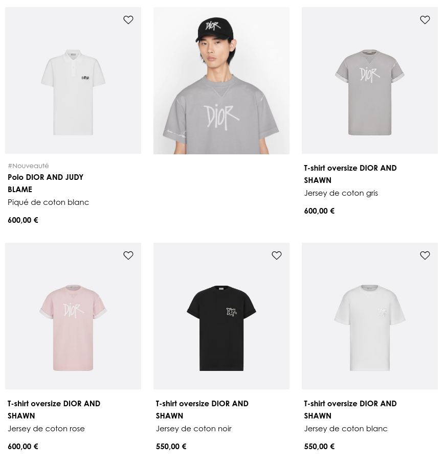
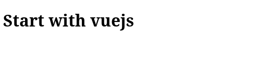
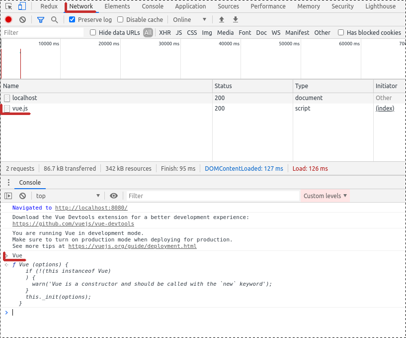
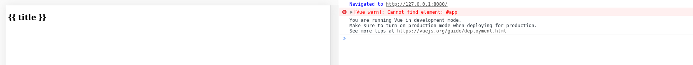

# Débuter avec Vuejs

Débutons de ce pas avec Vuejs, un des avantages de vuejs est sa facilité d'accès par rapport à d'autres framework, nous allons le voire en utilisant vuejs directement dans un fichier HTML classique.

Cette introduction est aussi l'occasion d'introduire le fonctionnement des exercices pratique.

D'ici la fin de cette introduction, nous allons afficher une breve liste récapitulative de produits tel qu'on peut le trouver sur une page listant des produits, par exemple les T-shirts:



Débutons:

- Il y a un simple fichier HTML, tu peux le servir grace à un package npm installé globalement, dans ton terminal utilise:

```bash
cd exercises/1_starting_with_vuejs
http-server
```

puis rends toi dans ton navigateur internet à l'adresse: [http://localhost:8080/](http://localhost:8080/), tu devrais voir:



## Ajouter Vue.js

- Commençons par ajouter vuejs dans la page, pour ce faire ajoute une balise script dans ta page pointant vers le script locale `dev_vue.js`, c'est la version développement de vuejs. Si tout a bien fonctionné, tu peux désormais appeler `Vue` dans ta console de développeur:



- Il faut maintenant créer une instance de Vue.js dans la page, c'est à dire initialiser Vue.js. Pour ce faire, il suffit d'ajouter une balise script dans la page:

```js
var app = new Vue({
  el: '#app',
});
```

Comment tu peux le voire, cette instance prends un élément qui sera la racine de l'application Vue.js, c'est à dire que Vue.js n'interagira qu'avec les éléments contenu dans cet élément racine. Créons alors une balise `div` avec l'id app pour servir de racine. Cette balise contiendra le titre de la page `h1`.
Pour terminer changeons le titre de la page dynamiquement, pour ce faire le titre de la page doit être injecté par Vue.js, on doit donc interpréter une variable, par défaut en Vue.js pour interpréter une variable dans du HTML, il suffit de l'encadrer de braquets: `{{ title }}`. Il faut aussi définir cette variable dans notre instance Vue.js, on peut le faire grâce à l'objet `data` de l'instance:

```js
var app = new Vue({
  el: '#app',
  data: {
    title: "I'm starting with vuejs at: " + new Date().toLocaleString(),
  },
});
```

Tu devrais voire la date à jour à chaque fois que tu recharge ta page web:


Si tu as une erreur et que tu vois seulement `{{ title }}` comme :

Il est nécessaire que la balise qui contient l'app soit déjà defini avant d'initialiser l'instance vuejs, tu dois donc ajouter le script `new Vue` à la fin du body.

Tu peux maintenant passer au rendu [déclaratif de vuejs](../DeclarativeRendering/README.md) où nous commencerons à fabriquer le récapitulatif d'un produit.
